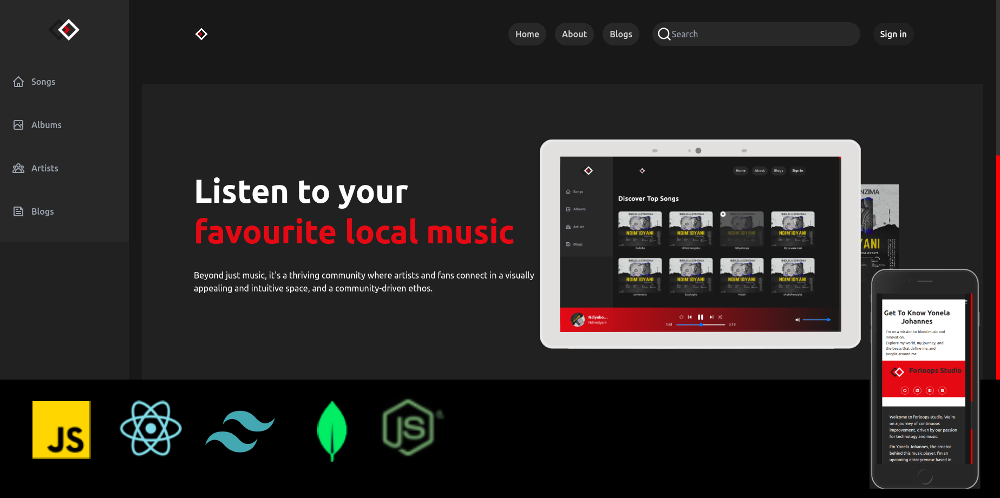

# Forloops Studio(FL Studio)

A web application built with React, Vite, Tailwind, Redux Toolkit, Nodejs and MongoDb... The application features a music player and blogging/news.



## Demo

You can check out a live demo of the application [here](https://forloops-studio.vercel.app").

## Features

- Search for songs
- Play and pause songs using a music player
- Control the volume of the music player
- Skip to the next or previous song
- Display the song title, artist, and album artwork
- Repeat song

- 🛠️ Complete music player built from scratch in React/Vite
- 💻 Beautiful landing page & detail pages included
- 🎨 Custom artwork included
- 💳 Full admin dashboard
- 🔑 Authentication
- 🌟 Clean, modern UI using Tailwind
- ✉️ Google popup for signing in and up
- 🎁 ...much more

## Technologies

### Frontend
- **React:** A JavaScript library for building user interfaces.
- **Vite:** A build tool that focuses on fast development and server rendering.
- **Tailwind CSS:** A utility-first CSS framework for building custom designs quickly.
- **Redux Toolkit:** A set of tools and guidelines for efficient Redux development.

### Backend
- **Node.js:** used for server-side development.
- **Express:** A fast, unopinionated, minimalist web framework for Node.js, ideal for building robust and scalable web applications.

### Database
- **MongoDB:** A NoSQL database that provides high performance, high availability, and easy scalability.

## Project Structure

The project is organized to ensure a clean and efficient development process. Key features include:

- **Client:** Frontend built with React, Vite, and Tailwind CSS.
- **Server:** Backend powered by Node.js and Express, connected to a MongoDB database.
-
## Getting started

1. Clone the repository:

```~~bash~~
git clone https://github.com/Yonela-Johannes/forloops-studio

```

2. Install the dependencies:
  ```bash
    cd forloops-studio
    npm install
  ```

3. Start the development server:
npm run dev

## Available commands

Running commands with npm `npm run [command]`

| command         | description                              |
| :-------------- | :--------------------------------------- |
| `dev`           | Starts a development instance of the app |

4. Open the application in your browser at http://localhost:3000.

## Contributing

If you would like to contribute to this project, please fork the repository and create a pull request.

## License

This project is licensed under the [MIT License](LICENSE).
